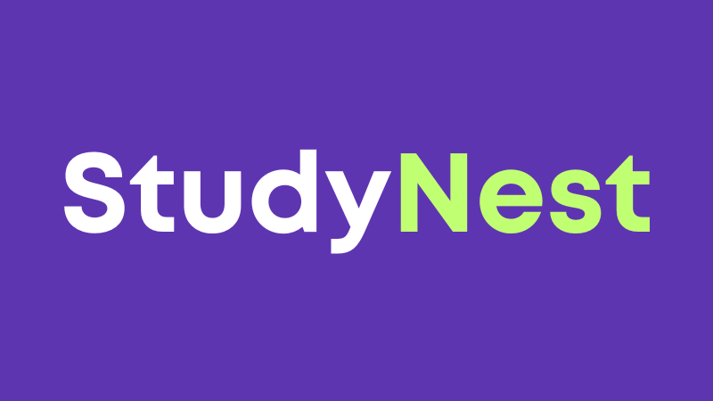

# StudyNest - E-Learning Platform

A Django-based e-learning platform that allows tutors to create and sell courses while students can enroll and track their progress.

## Live Demo

Visit the live project: [https://studynest-q9tc.onrender.com](https://studynest-q9tc.onrender.com)

## Demo Video

Watch the screen-recorded walkthrough: [https://photos.app.goo.gl/PiwabqbbnwcxN1sU7](https://photos.app.goo.gl/PiwabqbbnwcxN1sU7)

## Features

- **User Authentication**: Separate registration for students and tutors
- **Course Management**: Tutors can create, edit, and manage courses with modules and lessons
- **Video Lessons**: YouTube integration for video content
- **Payment Processing**: Stripe integration for paid courses (sandbox mode)
- **Progress Tracking**: Students can track their learning progress
- **Course Reviews**: Students can rate and review courses
- **Search & Filter**: Browse courses by category, price, or search terms

## Tech Stack

- **Backend**: Django (Python)
- **Frontend**: HTML, CSS, Bootstrap 5
- **Database**: SQLite (development) / MySQL (production-ready)
- **Payment**: Stripe API
- **Video Hosting**: YouTube (embedded)

## Installation

1. Clone the repository
2. Create a virtual environment: `python -m venv venv`
3. Activate virtual environment: `venv\Scripts\activate` (Windows)
4. Install dependencies: `pip install -r requirements.txt`
5. Create `.env` file with your configuration
6. Run migrations: `python manage.py migrate`
7. Create superuser: `python manage.py createsuperuser`
8. Run server: `python manage.py runserver`

## Test Credentials

For Stripe payments, use the following test card:

- **Card Number**: `4242 4242 4242 4242`
- **Expiry Date**: Any future date (e.g., `12/34`)
- **CVC**: Any 3 digits (e.g., `123`)
- **Email**: Any email (e.g., `user@gmail.com`)

## Notes

- Uses Stripe sandbox for payment demonstration
- Designed for easy migration to AWS S3 for video hosting

## Future Enhancements

- Direct video uploads to AWS S3
- Certificate generation
- Discussion forums
- Live sessions
- Mobile app API
